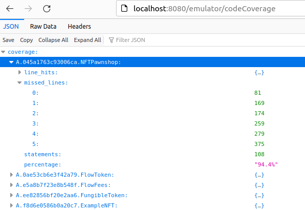

# NFT Pawnshop

Pawn your illiquid or underperforming NFTs, save thousands in tax money or simply get some liquidity during tough times.

## ✨ Getting Started

### 1. Install Dependencies

_🛠 This project requires `NodeJS v16.x` or above._ See: [Node installation instructions](https://nodejs.org/en/) <br/>
_🛠 This project requires `flow-cli v0.49.0` or above._ See: [Flow CLI installation instructions](https://developers.flow.com/tools/flow-cli/install) <br/>

### 2. Clone the project

```bash
git clone https://github.com/Build-Squad/nft-pawnshop.git
```

### 3. Install packages

```bash
cd nft-pawnshop
npm install
```

## Local demo

Run the emulator with:

```bash
flow emulator --storage-limit=false --contracts --coverage-reporting -v
```

and create a few accounts that will be used for demonstrating the basic flows.

```bash
flow keys generate --output=json > peter.json
flow keys generate --output=json > emulator-admin.json
flow keys generate --output=json > john-buyer.json

# Create an account for each of the three keys above, in the same order.
flow accounts create --key
```

Make sure to update the private keys in the `flow.json` file.

Deploy the contracts with:

```bash
flow project deploy --network=emulator
```

Perform the necessary setup for the `NFTPawnshop` contract, and the admin account:

```bash
flow transactions send ./cadence/transactions/setup_storefront.cdc --network=emulator --signer=emulator-admin

flow transactions send ./cadence/transactions/setup_nft_catalog.cdc --network=emulator --signer=emulator-admin

flow transactions send ./cadence/transactions/transfer_flow_tokens.cdc 0x045a1763c93006ca 1500.0 --network=emulator --signer=emulator-account

flow transactions send ./cadence/transactions/fund_admin_vault.cdc 1000.0 --network=emulator --signer=emulator-admin

node cadence/transactions/add_admin_collection.mjs
```

With a proper setup, we should get:

```bash
flow scripts execute ./cadence/scripts/get_admin_balance.cdc --network=emulator

Result: 1000.00000000

flow scripts execute ./cadence/scripts/get_collection_names.cdc --network=emulator

Result: ["ExampleNFT"]

flow scripts execute ./cadence/scripts/get_sale_price.cdc --network=emulator

Result: 15.00000000
```

Let's setup the account of `peter`, to hold some NFTs from the `ExampleNFT` collection, which is included on the `NFTCatalog`.

```bash
flow transactions send ./cadence/transactions/transfer_flow_tokens.cdc 0xe03daebed8ca0615 1500.0 --network=emulator --signer=emulator-account

node cadence/transactions/setup_collection.mjs "ExampleNFT" peter

flow transactions send ./cadence/transactions/setup_account_to_receive_royalty.cdc '/storage/flowTokenVault' --network=emulator --signer=emulator-account

flow transactions send ./cadence/transactions/mint_nft.cdc 0xe03daebed8ca0615 'My Example NFT' 'My Example NFT Description' 'https://www.example-nft.com/thumbnails/0' '[0.05]' '["Tribute to Creator!"]' '[0xf8d6e0586b0a20c7]' --network=emulator --signer=emulator-account

flow transactions send ./cadence/transactions/mint_nft.cdc 0xe03daebed8ca0615 'My Example NFT #2' 'My Example NFT Description #2' 'https://www.example-nft.com/thumbnails/2' '[0.02]' '["Tribute to Creator!"]' '[0xf8d6e0586b0a20c7]' --network=emulator --signer=emulator-account
```

The above account, should now contain 2 NFTs, which the holder can pawn to the contract:

```bash
flow scripts execute ./cadence/scripts/get_collection_ids.cdc 0xe03daebed8ca0615 --network=emulator

Result: [0, 1]
```

To pawn NFTs for a specific collection, run:

```bash
flow transactions send ./cadence/transactions/setup_pledge_collection.cdc --network=emulator --signer=peter

flow transactions send ./cadence/transactions/pawn_nfts.cdc "ExampleNFT" '[1]' --network=emulator --signer=peter

flow transactions send ./cadence/transactions/pawn_nfts.cdc "ExampleNFT" '[0]' --network=emulator --signer=peter
```

Note that multiple NFTs for a specific collection can be pawned with a single transaction also, by
passing `'[0, 1]'`. For demo purposes, we made it in two transactions.

Let's observe the side effects of these transactions:

```bash
flow scripts execute ./cadence/scripts/get_admin_balance.cdc --network=emulator

# The admin account currently pays 15 FLOW tokens for each NFT, that's why its
# balance was reduced by 30 FLOW tokens (2 * 15 = 30). In the real world, each
# NFT should be properly valuated by the owner of the pawnshop.
Result: 970.00000000

flow accounts get 0xe03daebed8ca0615

# The 30 FLOW tokens were deposited to the account of `peter`
Address	 0xe03daebed8ca0615
Balance	 1530.00000000
```

```bash
flow scripts execute ./cadence/scripts/get_collection_ids.cdc 0xe03daebed8ca0615 --network=emulator

# After pawning the 2 NFTs from the `ExampleNFT` collection, the account of `peter`
# has no NFTs in its collection, which is expected.
Result: []

flow scripts execute ./cadence/scripts/get_admin_collection.cdc "ExampleNFT" --network=emulator

# This implies that the 2 NFTs, were deposited to the `ExampleNFT` collection of the
# admin account.
Result: [1, 0]
```

As with real-world pawn shops, the account of `peter` receives a pledge, which allows
the debitor to redeem the pawned NFTs, within the period of a year, by paying the sale
price.

```bash
flow scripts execute ./cadence/scripts/get_pledge_collection_info.cdc 0xe03daebed8ca0615 --network=emulator
```

```cadence
Result: [
    A.045a1763c93006ca.NFTPawnshop.PledgeInfo(
        id: 56,
        debitor: 0xe03daebed8ca0615,
        expiry: 1704892702.00000000,
        pawns: A.045a1763c93006ca.NFTPawnshop.NFTPawnInfo(
            collectionIdentifier: "ExampleNFT",
            nftIDs: [0],
            salePrice: 15.00000000
        )
    ),
    A.045a1763c93006ca.NFTPawnshop.PledgeInfo(
        id: 58,
        debitor: 0xe03daebed8ca0615,
        expiry: 1704892698.00000000,
        pawns: A.045a1763c93006ca.NFTPawnshop.NFTPawnInfo(
            collectionIdentifier: "ExampleNFT",
            nftIDs: [1],
            salePrice: 15.00000000
        )
    )
]
```

The above exists as a resource (`NFTPawnshop.PledgeCollection`) in the account storage of `peter`.
However, the same info can be found in the contract:

```bash
flow scripts execute ./cadence/scripts/get_admin_pledges.cdc --network=emulator
```

```cadence
Result: {
    58: A.045a1763c93006ca.NFTPawnshop.PledgeInfo(
        id: 58,
        debitor: 0xe03daebed8ca0615,
        expiry: 1704892698.00000000,
        pawns: A.045a1763c93006ca.NFTPawnshop.NFTPawnInfo(
            collectionIdentifier: "ExampleNFT",
            nftIDs: [1],
            salePrice: 15.00000000
        )
    ),
    56: A.045a1763c93006ca.NFTPawnshop.PledgeInfo(
        id: 56,
        debitor: 0xe03daebed8ca0615,
        expiry: 1704892702.00000000,
        pawns: A.045a1763c93006ca.NFTPawnshop.NFTPawnInfo(
            collectionIdentifier: "ExampleNFT",
            nftIDs: [0],
            salePrice: 15.00000000
        )
    )
}
```

Let's see how `peter` can redeem each of the pawned NFTs:

```bash
flow transactions send ./cadence/transactions/redeem_pledge.cdc "ExampleNFT" 56 --network=emulator --signer=peter

flow transactions send ./cadence/transactions/redeem_pledge.cdc "ExampleNFT" 58 --network=emulator --signer=peter
```

Let's observe the side effects of this transaction:

```bash
flow scripts execute ./cadence/scripts/get_admin_balance.cdc --network=emulator

# The admin account received 30 FLOW tokens
Result: 1000.00000000

flow accounts get 0xe03daebed8ca0615

# The account of `peter` paid 30 FLOW tokens
Address	 0xe03daebed8ca0615
Balance	 1500.00000000

flow scripts execute ./cadence/scripts/get_collection_ids.cdc 0xe03daebed8ca0615 --network=emulator

# The `ExampleNFT` collection of `peter` regained possession of the 2 pawned NFTs
Result: [0, 1]

flow scripts execute ./cadence/scripts/get_admin_collection.cdc "ExampleNFT" --network=emulator

# The `ExampleNFT` collection of `emulator-admin` is now empty.
Result: []
```

Upon successful redemption, the contract should have no pledges now:

```bash
flow scripts execute ./cadence/scripts/get_admin_pledges.cdc --network=emulator

Result: {}
```

This was the basic flow where an account holder pawned some NFTs, received some FLOW tokens
and was able to redeem them, during the grace period, without needing any permission from
the smart contract or its admin.

Now let's see what would happen in the scenario where an account holder was not able to
redeem during the grace period.

The default grace period is 1 year, so let's reduce it to just a second, for our demo. This
doesn't affect already existing pledges. We also changed the sale price to 10 FLOW tokens, this also doesn't affect already existing pledges.

```bash
flow transactions send ./cadence/transactions/update_default_expiry.cdc 1.0 --network=emulator --signer=emulator-admin

flow transactions send ./cadence/transactions/update_sale_price.cdc 10.0 --network=emulator --signer=emulator-admin
```

This time, `peter` pawns just one NFT:

```bash
flow transactions send ./cadence/transactions/pawn_nfts.cdc "ExampleNFT" '[1]' --network=emulator --signer=peter
```

```bash
flow scripts execute ./cadence/scripts/get_pledge_collection_info.cdc 0xe03daebed8ca0615 --network=emulator

flow transactions send ./cadence/transactions/redeem_pledge.cdc "ExampleNFT" 62 --network=emulator --signer=peter

error: panic: The reedem period has expired!
   --> 045a1763c93006ca.NFTPawnshop:109:16
```

The redeem was unsuccessful. This means that the admin account can only now transfer the proceeds,
meaning the expired pledges.

```bash
flow transactions send ./cadence/transactions/admin_transfer_proceeds.cdc "ExampleNFT" 0x045a1763c93006ca --network=emulator --signer=emulator-admin
```

To verify that it worked:

```bash
flow scripts execute ./cadence/scripts/get_collection_ids.cdc 0x045a1763c93006ca --network=emulator

Result: [1]
```

The `NFTPawnshop` contract, and the account where it is deployed, has `NFTStorefrontV2` installed,
meaning it can sell the proceeds:

```bash
flow transactions send ./cadence/transactions/sell_item_via_catalog.cdc "ExampleNFT" 1 7.5 "NFT Pawnshop Marketplace" 0.0 1704124654 '[]' --network=emulator --signer=emulator-admin
```

Let's view the created listing and its details:

```bash
flow scripts execute ./cadence/scripts/get_storefront_ids.cdc 0x045a1763c93006ca --network=emulator

Result: [63]

flow scripts execute ./cadence/scripts/get_listing_details.cdc 0x045a1763c93006ca 63 --network=emulator

Result: A.045a1763c93006ca.NFTStorefrontV2.ListingDetails(
    storefrontID: 37,
    purchased: false,
    nftType: Type<A.f8d6e0586b0a20c7.ExampleNFT.NFT>(),
    nftUUID: 45,
    nftID: 1,
    salePaymentVaultType: Type<A.0ae53cb6e3f42a79.FlowToken.Vault>(),
    salePrice: 7.50000000,
    saleCuts: [
        A.045a1763c93006ca.NFTStorefrontV2.SaleCut(
            receiver: Capability<&AnyResource{A.ee82856bf20e2aa6.FungibleToken.Receiver}>(address: 0xf8d6e0586b0a20c7, path: /public/GenericFTReceiver),
            amount: 0.15000000
        ),
        A.045a1763c93006ca.NFTStorefrontV2.SaleCut(
            receiver: Capability<&AnyResource{A.ee82856bf20e2aa6.FungibleToken.Receiver}>(address: 0x045a1763c93006ca, path: /public/flowTokenReceiver),
            amount: 7.35000000
        )
    ],
    customID: "NFT Pawnshop Marketplace",
    commissionAmount: 0.00000000,
    expiry: 1704124654
)
```

We can buy this listing with the `john-buyer` account:

```bash
# First we need to setup the account's collection.
node cadence/transactions/setup_collection.mjs "ExampleNFT" john-buyer

flow transactions send ./cadence/transactions/transfer_flow_tokens.cdc 0x120e725050340cab 1500.0 --network=emulator --signer=emulator-account

flow transactions send ./cadence/transactions/buy_item_via_catalog.cdc "ExampleNFT" 63 0x045a1763c93006ca 0x045a1763c93006ca --network=emulator --signer=john-buyer
```

We can verify the purchase with:

```bash
flow scripts execute ./cadence/scripts/get_collection_ids.cdc 0x120e725050340cab --network=emulator

Result: [1]
```

While at it, let's cleanup the purchased listing from the Storefront:

```bash
flow transactions send ./cadence/transactions/cleanup_purchased_listings.cdc 0x045a1763c93006ca 63 --network=emulator --signer=emulator-admin

flow scripts execute ./cadence/scripts/get_storefront_ids.cdc 0x045a1763c93006ca --network=emulator

Result: []
```

This was the basic flow from the side of the pawn shop's admin, showing how to utilise the expired pledges.

### Security guarantees

From the perspective of the debitor (account holder with a `Pledge` resource), the only accessible method is the `redeemNFT`, which accepts the collection identifier, the `NonFungibleToken.Receiver` capability and a `FungibleToken.Vault` containing the necessary fees.

```cadence
pub resource Pledge: PledgePublic, PledgePrivate {
    access(contract) let debitor: Address
    access(contract) let expiry: UFix64
    access(contract) let pawns: NFTPawnInfo

    ...
}
```

The `debitor`, `expiry` and `pawns` fields can only be accessed by the contract itself, not even the
resource owner. To verify, run:

```bash
flow transactions send ./cadence/transactions/user_rug_pull.cdc "ExampleNFT" 50 --network=emulator --signer=peter

...
error: cannot access `expiry`: field has contract access
  --> 8778a81dba69f9b99095b68eb0568f932c7d0c1adaf1d3ed21867d8547bc95e3:17:8
   |
17 |         pledge.expiry = 1735825572.0
   |         ^^^^^^^^^^^^^

error: cannot assign to `expiry`: field has contract access
  --> 8778a81dba69f9b99095b68eb0568f932c7d0c1adaf1d3ed21867d8547bc95e3:17:15
   |
17 |         pledge.expiry = 1735825572.0
   |                ^^^^^^ consider making it publicly settable with `pub(set)`

error: cannot assign to constant member: `expiry`
  --> 8778a81dba69f9b99095b68eb0568f932c7d0c1adaf1d3ed21867d8547bc95e3:17:15
   |
17 |         pledge.expiry = 1735825572.0
...
```

From the perspective of the admin account, where the contract is deployed, the pawned NFTs and their
respective collections, are also accessible only to the contract itself, and not the admin account.

```cadence
access(contract) let collections: @{String: NonFungibleToken.Collection}
```

The admin account, which has an `Admin` resource in the account storage, can only call the
`transferProceeds` method, which also accepts a `NonFungibleToken.Receiver` capability. This method
does not touch pledges within the grace period:

```cadence
if (pledgeInfo.expiry > getCurrentBlock().timestamp) {
    continue
}
```

To verify, run:

```bash
flow transactions send ./cadence/transactions/admin_rug_pull.cdc "ExampleNFT" 0xac69e3c69589639e --network=emulator --signer=emulator-admin

error: cannot access `collections`: field has contract access
  --> ee977550c874e35dbff1f341c0b2497e5688482eb18bfe456e6d0bc7c8a4095c:18:27
   |
18 |         let collection = (&NFTPawnshop.collections[identifier] as auth &NonFungibleToken.Collection?)!
```

### Code Coverage

By interacting with the Emulator when:
- Deploying smart contracts,
- Executing scripts,
- Sending transactions

we are able to get the code coverage for our `NFTPawnshop` smart contract. Head over to http://localhost:8080/emulator/codeCoverage and search for the `A.045a1763c93006ca.NFTPawnshop` key in the resulting JSON response. It should look something like this:



That is quite a lot of code that we managed to cover with our demo!

### Front-End

This part is still a work-in-progress! More to come soon :pray:
